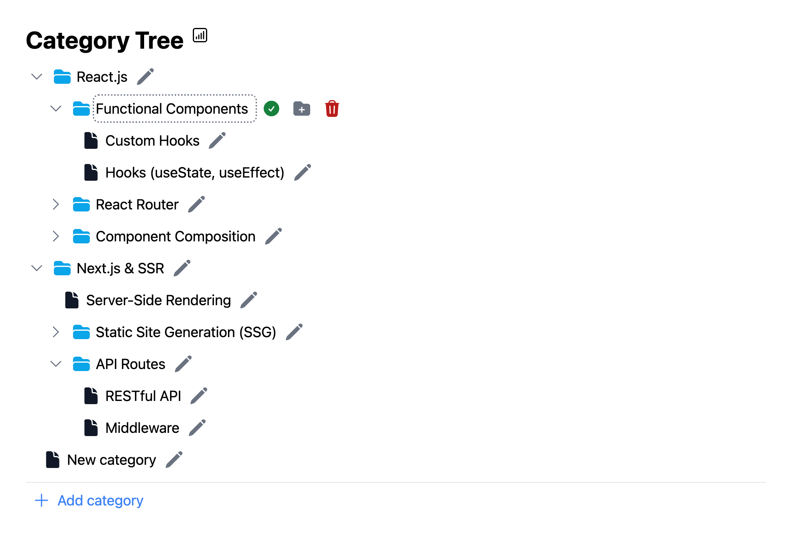

# Category Tree

A simple category tree application built with React, TypeScript, Tailwind CSS, and Vite. The app allows users to create, edit, and manage hierarchical categories and subcategories, with all data stored in Firebase.



## Features

- **Add Category/Subcategory**: Easily add new categories or subcategories within the existing structure.
- **Edit Category Name**: Rename any category or subcategory in the tree.
- **Delete Category**: Remove categories along with all their subcategories.
- **Expand/Collapse Parent Category**: Expand or collapse parent categories, hiding or showing their children.
- **CRUD Operations in Firebase**: Full create, read, update, and delete functionality with Firebase integration.

## Technologies Used

- **React**: For building the user interface.
- **TypeScript**: Ensures type safety and better code readability.
- **Tailwind CSS**: Provides utility-first CSS for rapid UI development.
- **Vite**: A fast development environment and build tool.
- **Firebase Firestore**: Real-time NoSQL database for storing the category tree data.
- **Zustand**: Lightweight state management library used for managing the state of the category tree.

## Installation

To run the project locally, follow these steps:

1. **Install dependencies**:

   ```bash
   pnpm install # or npm install
   ```

2. **Set up Firebase**:

   Add environment variables to the `.env` file:

   ```bash
   VITE_FIREBASE_API_KEY=your-api-key
   VITE_FIREBASE_AUTH_DOMAIN=your-auth-domain
   VITE_FIREBASE_PROJECT_ID=your-project-id
   VITE_FIREBASE_STORAGE_BUCKET=your-storage-bucket
   VITE_FIREBASE_MESSAGING_SENDER_ID=your-messaging-sender-id
   VITE_FIREBASE_APP_ID=your-app-id
   ```

3. **Run the development server**:

   ```bash
   pnpm run dev # or npm run dev
   ```

4. **Open the application**:

   Navigate to `http://localhost:5173` in your web browser.
